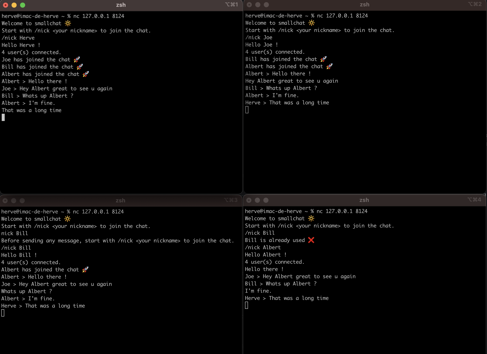

# Smallchat

TLDR: writing a very simple IRC server is an experience everybody should do

# Installation

```
yarn
yarn start
```

# How to use it ?

Open a new terminal, and launch a netcat client with :
```
nc 127.0.0.1 8124
``` 

Run 2 or 3 clients to chat together.

.

